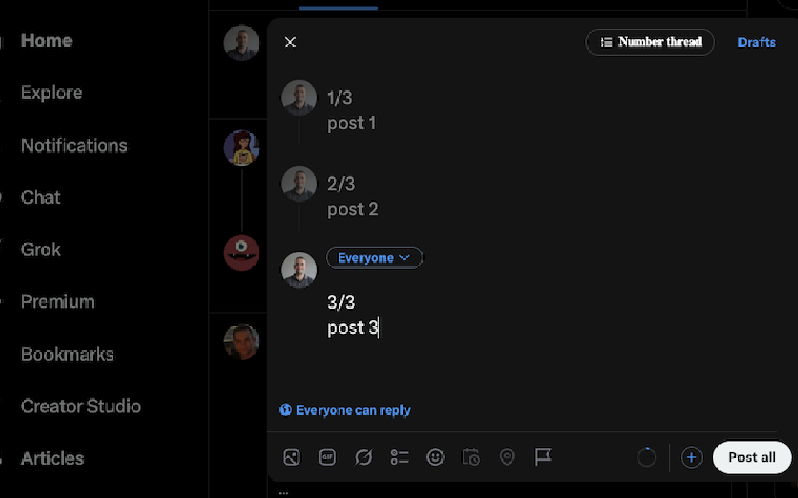

# Thread Numberer for X

A Chrome (Manifest V3) extension that numbers the posts of your X/Twitter thread
with one click — in whatever format and position you choose. Click again after
adding or removing a post and it re-sequences everything and fixes the totals.



## Install (load unpacked)

1. Open `chrome://extensions`.
2. Toggle **Developer mode** on (top-right).
3. Click **Load unpacked** and select this folder (`twitter_threads`).
4. Pin the extension and open its popup to pick your format.

## Use

1. On `x.com`, open the composer and build a thread (2+ posts).
2. In the popup, set your **position** (start/end), **format**, and whether the
   number sits on its own line.
3. Click the **Number thread** button in the composer's top bar (next to "Drafts") to write the numbers in.
4. Add/remove a post and click again — totals update, no duplicated numbers.

## Formats

- `n/total` → `1/5`
- `n/` → `1/`
- `n.` → `1.`
- **Custom template** with `{n}` and `{total}` tokens, e.g. `{n} of {total}`.

Position can be **prefix** (`1/5 text…`) or **suffix** (`text… 1/5`), and
"Start text on a new line" (on by default) puts the number on its own line with
the post body on the next row.

## How it works

- The number must become part of the tweet text to actually post, so the
  extension writes into X's DraftJS editor via `focus → selectAll → execCommand('insertText')`
  for the first line and a synthetic `paste` for any line break (a raw `\n` in
  `insertText` is dropped by DraftJS; its paste handler creates real blocks).
  Naive DOM writes don't survive React/DraftJS re-renders. Posts are numbered
  sequentially so each edit settles before the next, preserving every body.
- Numbering is **on-demand** (the button), so it never interrupts your typing.
- The scanner scopes to the active composer dialog and de-duplicates by the
  resolved editable element, so 3 posts number as 1/3, 2/3, 3/3 — not 2/6, 5/6, 6/6.
- It's a resident content script with a `MutationObserver` that injects/removes the
  button as a thread composer appears (X is a SPA and never re-injects the script).

## If X changes its DOM

Every selector lives in **`src/shared/selectors.js`**. If the button stops
appearing or numbering stops landing in the fields, that's the one file to
inspect/patch — confirm `tweetTextarea_N` is still the post field testid in
DevTools and update accordingly.

## Project layout

```
manifest.json
src/shared/    selectors, defaults, NumberingManager (pure), SettingsRepository
src/content/   ComposerScanner, EditorTextManager, ThreadNumberingService,
               ComposerButton, ComposerCoordinator, entry
src/popup/     popup.html/.css, PopupViewModel, entry
assets/        icons, vendored Inter font
```

`NumberingManager` is pure logic with no DOM/Chrome dependencies.

## Tests

The numbering logic (formatting, stripping, re-numbering, line breaks) is
covered by a dependency-free headless test:

```
node test/numbering.test.js
```

## License

[MIT](LICENSE) © Amit Raz. Not affiliated with, endorsed by, or sponsored by
X Corp; "X" and "Twitter" are trademarks of their respective owners.
